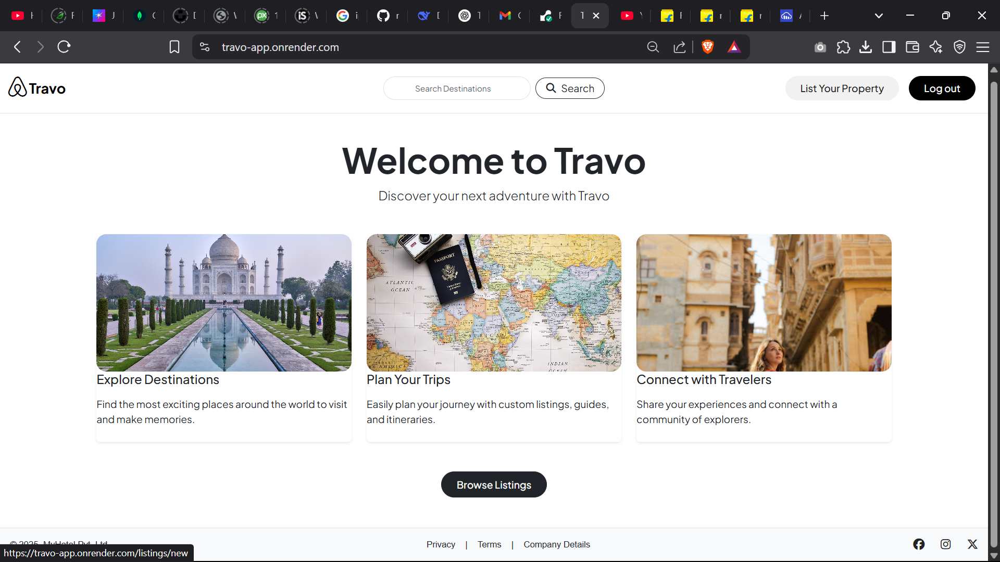
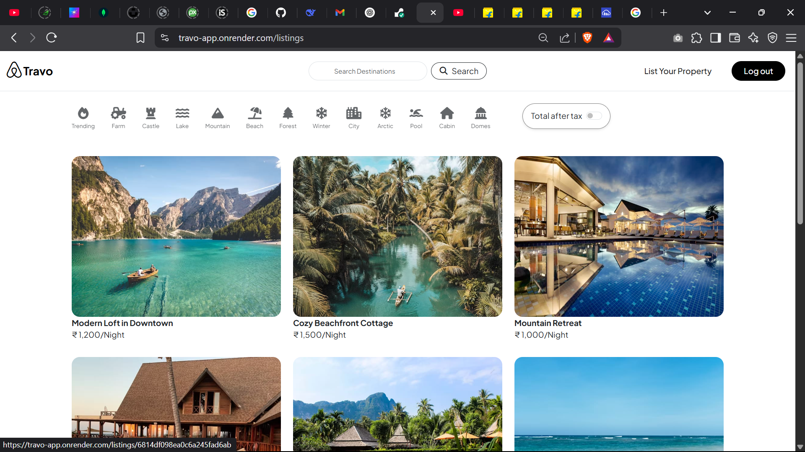
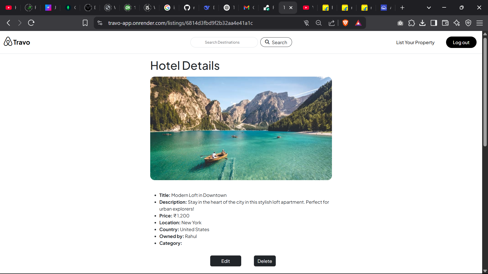
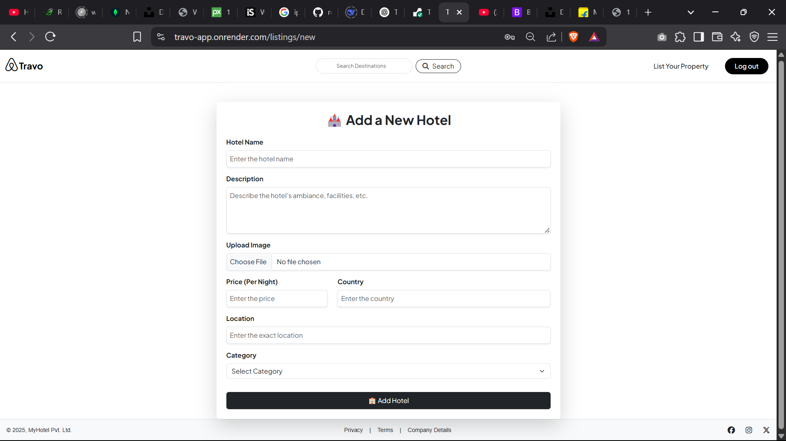
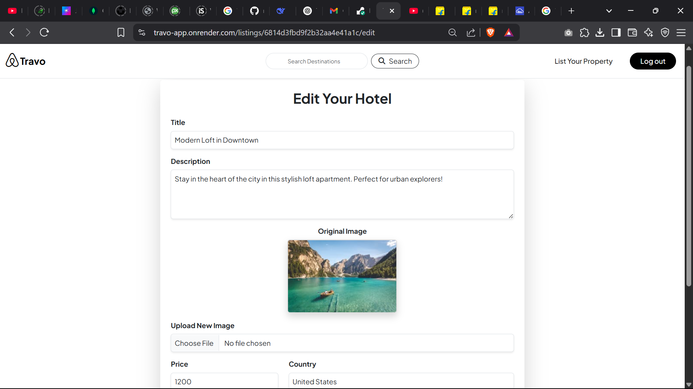
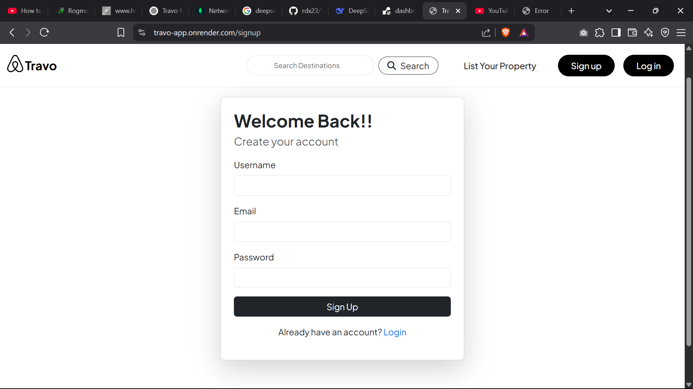
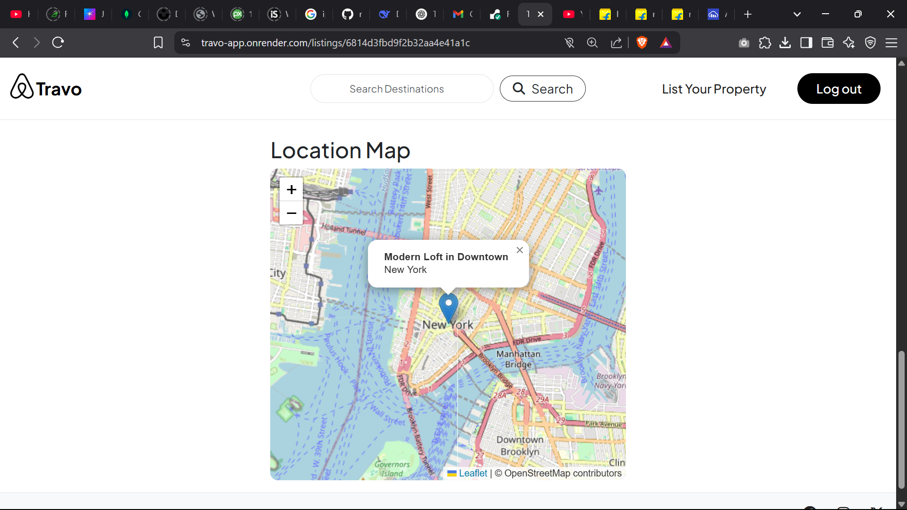
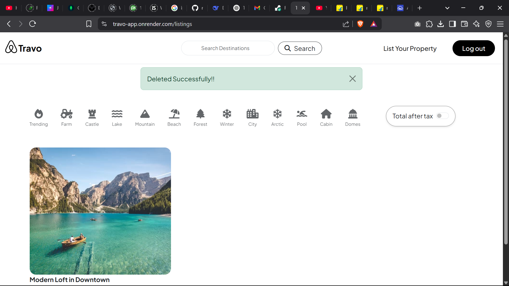
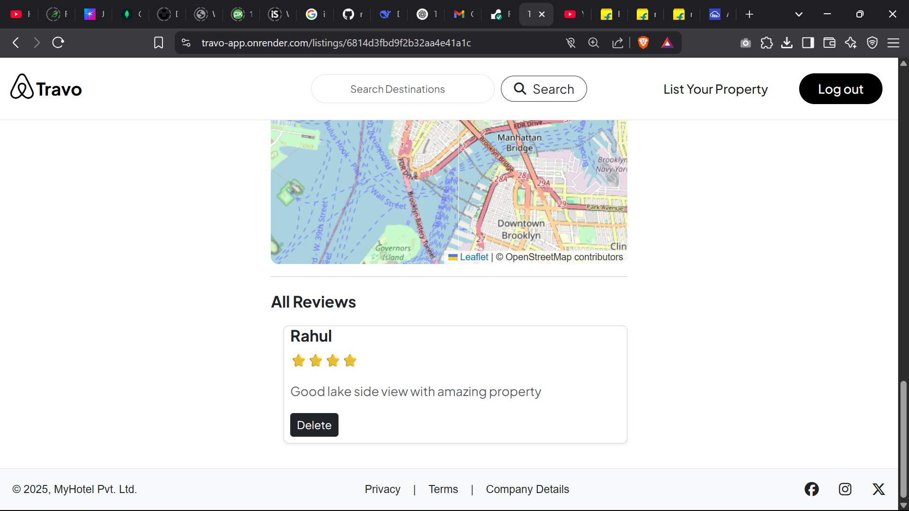

# 🌍 Travo – Travel Listing Web Application
## Live Demo 👉 https://travo-app.onrender.com

**Travo** is a full-stack travel listing platform where users can explore travel destinations, view details, manage their own listings, and connect with other travelers. Built with Node.js, Express, MongoDB, and EJS templating, Travo offers a clean and responsive interface for travel enthusiasts.

---

## 🚀 Features

- Beautiful, modern **Home Page** introducing the platform
- A complete **Listings Page** to browse all travel destinations
- **Detail View** for each listing with image and description
- Authenticated **Login & Signup Pages**
- Add new destinations via the **Add Listing Page**
- Edit or delete your listings with the **Edit Page**
- Responsive design using **Bootstrap 5**
- Image support including modern formats like **AVIF**
- Secure user authentication with **Passport.js**

---

## 📸 Screenshots

Below are the screenshots of all main pages:

### 🏠 Home Page  

 

### 📋 Listings Page  

 

### 🧾 Details Page  

 

### ➕ Add Listing Page  

 

### ✏️ Edit Listing Page  

 

### 🔐 Login Page  

 

### 📝 Signup Page  

 

### 🌍 Location Page  

 

### 🗑️ Delete Confirmation  

 

### 💬 Feedback Page  

 

---

## 🛠️ Tech Stack

- **Frontend**: EJS, HTML5, CSS3, Bootstrap 5, Javascript
- **Backend**: Node.js, Express.js
- **Database**: MongoDB (with Mongoose)
- **Authentication**: Passport.js
- **File Upload**: Multer
- **Templating**: EJS Layouts

---

##🔗 Live Application
🌐 Click here to explore Travo

